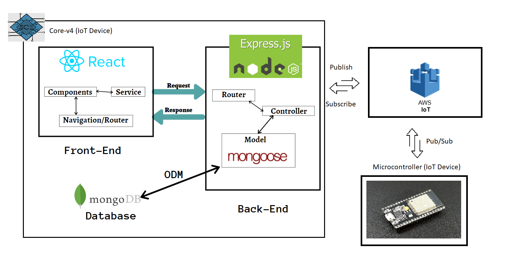

# Centauri

### Table of contents
- [Project Goal](#project-goal)
- [Tools & Technologies](#tools-and-technologies)
- [Project Architecture](#project-architecture)

### Project Goal
To implement an RFID door lock access system in the SCE club room's officer's room

### Tools and Technologies

|  ESP32 |  Arduino |  Node JS |  React JS |  Express JS| AWS IOT | MongoDB |
|---|---|---|---|---|---|---|

### Project Architecture

